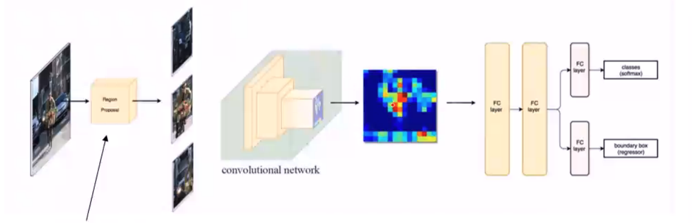
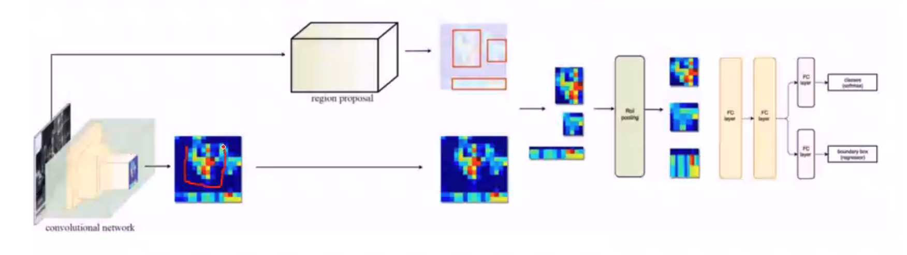
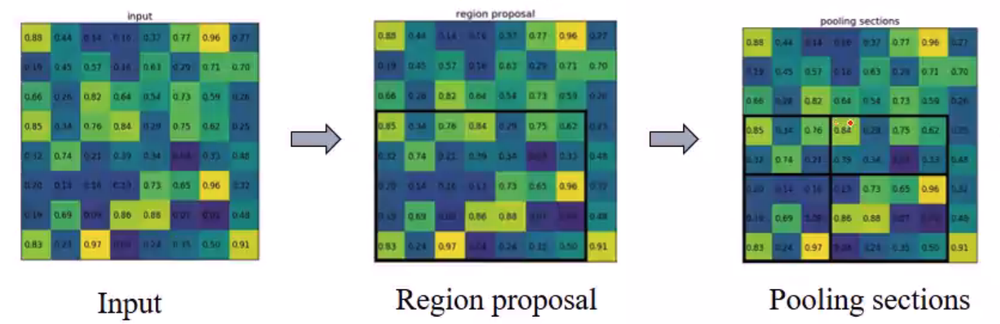
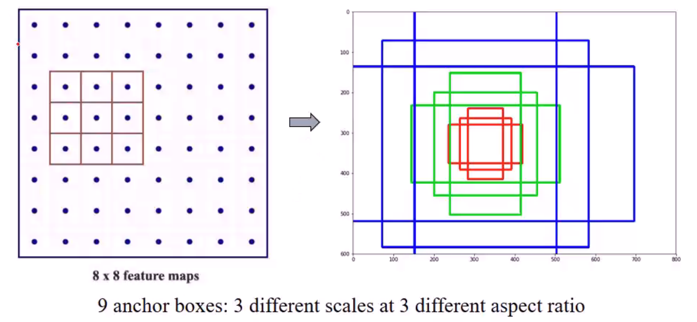

## Outline

> From R-CNN to Mask RCNN
>
> 1. R-CNN
> 2. Fast R-CNN
> 3. Faster R-CNN
> 4. FPN
> 5. FPN + RPN + Fast R-CNN = Faster R-CNN
> 6. FPN + RPN + Fast R-CNN + Mask Prediction = Mask R-CNN
>
> Mask R-CNN
>
> 1. ROI Align
>    1. Bilinear interplolation
>    2. RoI pooling->RoI align
> 2. Loss Function
> 3. Application

## From R-CNN to Mask R-CNN

Let's first go through those methods on how they detect object:

### Traditional method 

sliding windows detector. However, brute force approach cost too much time.

### R-CNN

Selective Search. Cluster them with colors/ ... which have similar features. Then merge these proposals.

Ideas: 

- Region proposal: selective search 2000 RoIs
- Bounding box regression and classification

**Bounding Box**

Proposal: $P_x, P_y, P_w, P_h$

Ground Truth: $G_x, G_y, G_w, G_h$

Mapping: 
$$
G_x = P_w d_x(P) + P_x\\
G_y = P_h d_y(P) + P_y\\
G_w = P_w \text{exp}(d_w(P))\\
G_h = P_h \text{exp}(d_h(P))
$$
The target is to learn parameters: $d_x, d_y, d_w, d_h$.

---

### Fast R-CNN

**Apply the region proposal method on the feature maps directly**

Ideas:

- Region proposal from feature maps instead of input image
- Warp the patches to a fixed size using ROI pooling

Limit: Still use selective search which is time-consuming

#### ROI Pooling

If we want 2 x 2 max pooling, then the final size of square will not be the same.

---

### Faster R-CNN

 

**Replaces the region proposal method by an internal deep network**

Ideas: Get region proposals by region proposal network (FPN)

Limit: Only use single scale feature map for detection

#### RPN

Prediction: For each location in feature maps, RPN make k guess.(k anchors).

Training: which object is the anchor responsible for? According to IoU.

---

### FPN

**Faster R-CNN is a sinle sacle object detection and may miss small objects**.

a) time consuming

b) faster rcnn: single scale object

c) SSD

d) FPN: Accurage location + High semantics

#### ResNet FPN

How to assign RoIs of different scales to the pyramid levels?

$k = [k_0 + log_2(\sqrt{wh}/ 224)]$

---

### Mask R-CNN

**FPN+RPN+Fast R-CNN+Mask Prediction = Mask R-CNN**

Backbone: ResNet-FPN

Head: Bounding box regression, classification and Mask prediction

